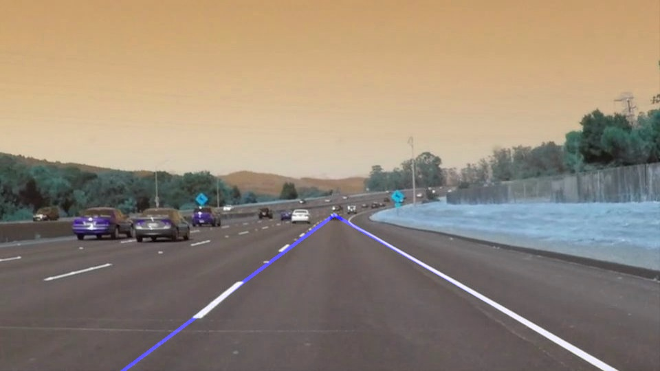
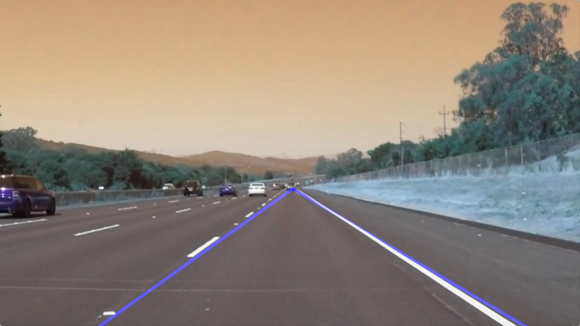
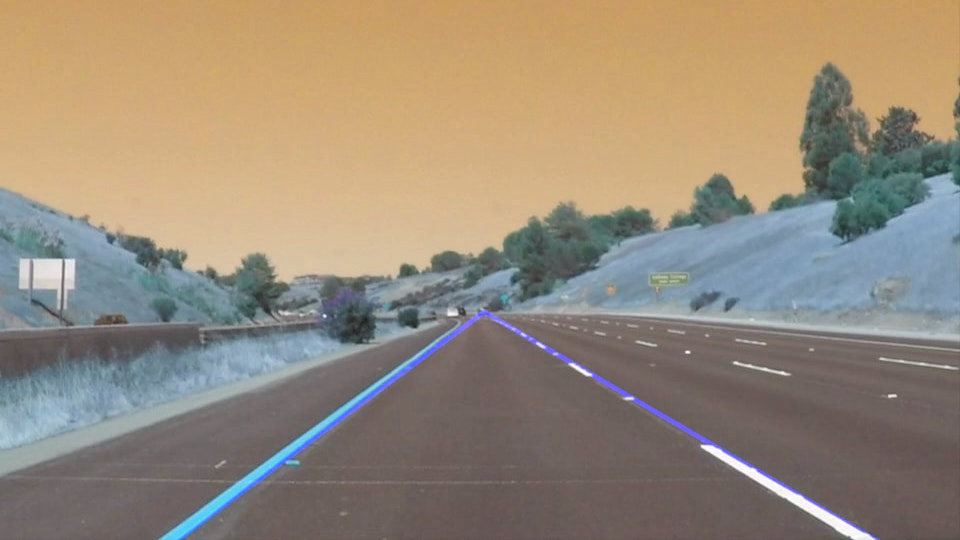
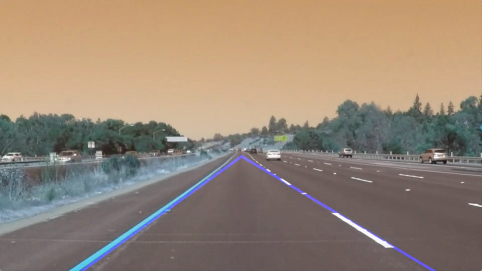
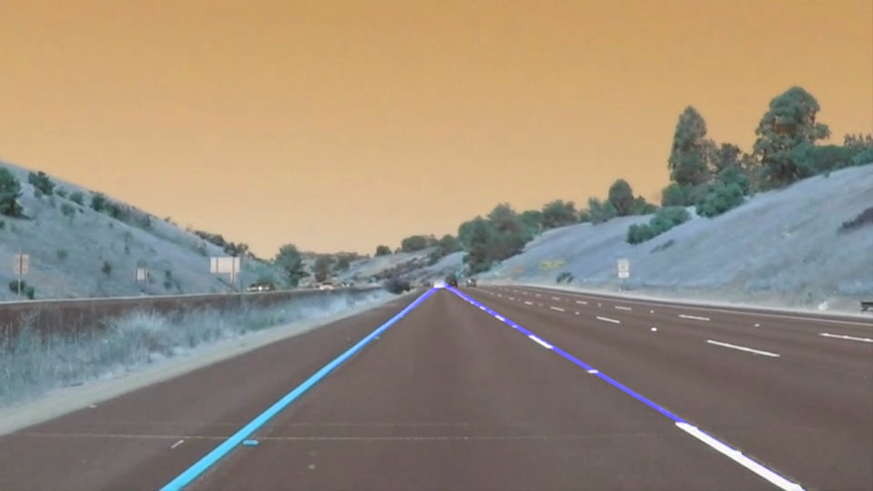

# **Finding Lane Lines on the Road**

[](http://www.udacity.com/drive)


## Overview

When we drive, we use our eyes to decide where to go. The lines on the road that show us where the lanes are act as our constant reference for where to steer the vehicle. Naturally, one of the first things we would like to do in developing a self-driving car is to automatically detect lane lines using an algorithm.

In this project you will detect lane lines in images using Python and OpenCV. OpenCV means "Open-Source Computer Vision", which is a package that has many useful tools for analyzing images.

To complete the project, two files will be submitted: a file containing project code and a file containing a brief write up explaining your solution. We have included template files to be used both for the [code](https://github.com/udacity/CarND-LaneLines-P1/blob/master/P1.ipynb) and the [writeup](https://github.com/udacity/CarND-LaneLines-P1/blob/master/writeup_template.md).The code file is called P1.ipynb and the writeup template is writeup_template.md

To meet specifications in the project, take a look at the requirements in the [project rubric](https://review.udacity.com/#!/rubrics/322/view)

## Creating a Great Writeup

For this project, a great writeup should provide a detailed response to the "Reflection" section of the [project rubric](https://review.udacity.com/#!/rubrics/322/view). There are three parts to the reflection:

1. Describe the pipeline

After the initial videos about computer vision fundamentals. I used the techniques taught in the videos like gaussian blur, canny edge detector, hough transformation.

```
Algorithm:
    1. Convert the image to gray scale
    2. blurring the images to get better edges - Gaussian blur
    3. Apply canny edge detector to get edges detected
    4. Create a mask image with lanes - narrowing down the lane lines only to the region of interest
    5. Apply hough transformation to get lines
    6. Filter lines
        i. identify left and right lanes using simple linear algebra
            using mid point of image and min & max allowed slope within left and right side of the point of view.
    7. create left and right lanes using numpy polyfit function
    8.  i. find intersection point of right and left lanes using numpy linear algebra function
    9.  ii. add the line segment to buffer
    10. draw the lines on the images
```

sample outputs:












2. Identify any shortcomings

The current pipeline has problems in case of bad lighting and curved roads. Also the intersection points and lanes lines are misaligned drastically during begining of the video.

3. Suggest possible improvements

I'm still learning computer vision, would update the repo with ways to update the lane finder pipeline in future. I've got some inspiration from online resources etc.
